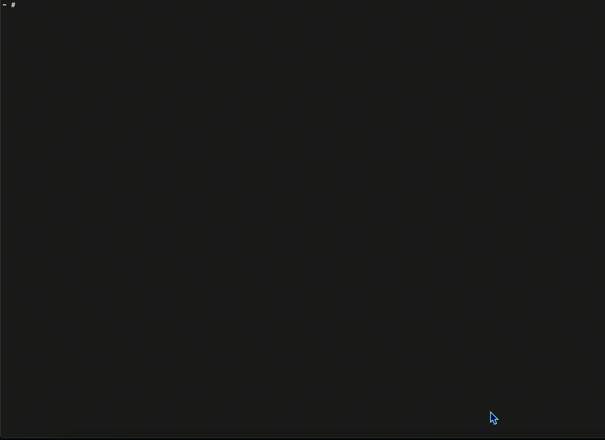

<p align="center">

</p>

# Jacked
[]()
[](https://goreportcard.com/report/github.com/carbonetes/jacked)
[](https://github.com/carbonetes/jacked/releases/latest)
[](https://github.com/carbonetes/jacked)
[](https://github.com/carbonetes/jacked/blob/main/LICENSE)

Jacked provides organizations with a more comprehensive look at their application to take calculated actions and create a better security approach. Its primary purpose is to scan vulnerabilities to implement subsequent risk mitigation measures. 

# Features
- 🐞 | Scans image vulnerability; checks if your image is at risk.
- 🔧 | Configuration that helps user's preference using the tool.
- ⛑ | Works with major operating system and many packages.
- 🗃 | Works seamlessly with [Diggity](https://github.com/carbonetes/diggity) (SBOM Container Image and File System)
- 🗄 | Converts results to JSON and Tabulated Format.


# Installation 📥

## Installation Support OS 💽
- Mac
  - darwin_amd64.tar.gz
  - darwin_arm64.tar.gz
- Linux
  - deb
    - linux_amd64.deb
    - linux_arm64.deb
    - linux_ppc64le.deb
  - rpm
    - linux_amd64.rpm
    - linux_arm64.rpm
    - linux_ppc64le.rpm
  - tar.gz
    - linux_amd64.tar.gz
    - linux_arm64.tar.gz
    - linux_ppc64le.tar.gz
- Windows
  - windows_amd64.zip

## Recommended

A great way to install a working binary tool on your terminal. 
```bash
curl -sSfL https://raw.githubusercontent.com/carbonetes/jacked/main/install.sh | sh -s -- -d /usr/local/bin
```
You can specify a release version and destination directory for the installation:

```
curl -sSfL https://raw.githubusercontent.com/carbonetes/jacked/main/install.sh | sh -s -- -d <DESTINATION_DIR> -v <RELEASE_VERSION>
```
### Homebrew
```sh
brew tap carbonetes/jacked
brew install jacked
```

# Getting Started 🚀  

## Run the CLI tool 🏁
Once you've successfully installed the Jacked and wanted to scan an image, on your terminal:
```
jacked <image>
```
You can also scan sbom json file from diggity.
```
jacked --sbom <path-to-your-sbom-file>
```

<details>
<summary>Jacked Running on a terminal:</summary>

<p align="center">

</p>

</details>

## Output formats

The output format for Jacked is configurable as well using the
`-o` (or `--output`) option:

The available `formats` are:
- `table`: A columnar summary (default).
- `json`: Use this to get as much information out of Jacked.
- `cyclonedx-xml`: An XML report conforming to the [CycloneDX 1.4 specification](https://cyclonedx.org/specification/overview/).
- `cyclonedx-json`: A JSON report conforming to the [CycloneDX 1.4 specification](https://cyclonedx.org/specification/overview/).
- `cyclonedx-vex-xml`: An XML report conforming to the [CycloneDX 1.4 specification](https://cyclonedx.org/specification/overview/).
- `cyclonedx-vex-json`: A JSON report conforming to the [CycloneDX 1.4 specification](https://cyclonedx.org/specification/overview/).
- `spdx-tag-value`: A tag-value formatted report conforming to the [SPDX 2.2 specification](https://spdx.github.io/spdx-spec/).
- `spdx-json`: A JSON report conforming to the [SPDX 2.2 JSON Schema](https://github.com/spdx/spdx-spec/blob/v2.2/schemas/spdx-schema.json).format.
- `spdx-xml`: A XML report conforming to the [SPDX 2.2 XML: Schema](https://github.com/mil-oss/spdx-xsd/blob/master/xml/xsd/spdx-xml-ref.xsd).format.
## Useful Commands and Flags 🚩
```
jacked [command] [flag]
```

|     SubCommand   |                  Description                 |
| :--------------- | :------------------------------------------- |
| `config`         | Display the current configurations           |
| `db`             | Display the database information             |
| `version`        |  Display Build Version Information of Jacked |

### Available Commands and their flags with description:
```
jacked [flag]
```
|                Root Flags                |                                                      Description                                                           |
| :--------------------------------------- | :------------------------------------------------------------------------------------------------------------------------- |
| `--sbom string`                          | Input sbom file from diggity to scan (Only read from json file)                                                            |
| `-d`, `--dir string`                     | Read directly from a path on disk (any directory) (e.g. 'jacked path/to/dir)'                                              |
| `-t`, `--tar string`                     | Read a tarball from a path on disk for archives created from docker save (e.g. 'jacked path/to/image.tar)'                 |
| `--disable-file-listing`                 | Disables file listing from package metadata (default false)                                                                |
| `--enabled-parsers stringArray`          | Specify enabled parsers ([apk debian java npm composer python gem rpm dart nuget go]) (default all)                        |
| `-l`, `--licenses`                       | Enable scanning for package licenses                                                                                       |
| `-o`, `--output string`                  | Show scan results in "table", "json", "cyclonedx-json", "cyclonedx-xml", cyclonedx-vex-json, cyclonedx-vex-xml, "spdx-json", "spdx-xml", "spdx-tag-value" format (default "table") |
| `--registry-uri string`                  | Registry uri endpoint (default "index.docker.io/")                                                                         |
| `--registry-token string`                | Access token for private registry access                                                                                   |
| `--registry-username string`             | Username credential for private registry access                                                                            |
| `--registry-password string`             | Password credential for private registry access                                                                            |
| `--secret-exclude-filenames stringArray` | Exclude secret searching for each specified filenames                                                                      |
| `--secret-max-file-size int`             | Maximum file size that the secret will search -- each file (default 10485760)                                              |
| `-v`, `--version`                        | Print application version                                                                                                  |

```
jacked config [flag]
```
|    Config Flags  |                Descriptions                  |
| :--------------- | :-------------------------------------------- |
| `-d`,`--display` | Display the content of the configuration file |
| `-h`,`--help`    | Help for configuration                        |
| `-p`,`--path`    | Display the path of the configuration file    |
| `-r`,`--reset`   | Restore default configuration file            |

```
jacked db [flag]
```
|   Database Flags   |               Descriptions              |
| :---------------- | :--------------------------------------- |
| `-i`, `--info`    | Print database metadata information      |
| `-v`, `--version` | Print database current version           |

```
jacked version [flag] [string]
```
|            Version Flags            |                                  Descriptions                                      |
| :--------------------------------- | :---------------------------------------------------------------------------------- |
| `-f` [string], `--format` [string] | Print application version format (json, text) (default "text")                      |

## Configuration 🚧
Improve using the tool based on your preferences.
<br>
Configuration search paths:
- `<HOME>/.jacked.yaml`

Configuration options (example values are the default):

```yaml
# supported output types: (table, json, cyclonedx-xml, cyclonedx-json, cyclonedx-vex-xml, cyclonedx-vex-json, spdx-xml, spdx-json, spdx-tag-value) (default "table") 
output: table
# disables all logging except vulnerability result
quiet: false
# policies configurations
ignore:
  # ignore policy for vulnerabilities to exclude
  vulnerability:
    cve: []
    severity: []
  # ignore policy for packages to exclude
  package:
    name: []
    type: []
    version: []
# specify enabled parsers ([apk debian java npm composer python gem rpm dart nuget go]) (default all)
enabled-parsers: []
# disables file listing from package metadata
disable-file-listing: false
# secret configurations
secret-config:
  # enables/disables cataloging of secrets
  disabled: false
  #secret content regex are searched within files that match the provided regular expression
  secret-regex: API_KEY|SECRET_KEY|DOCKER_AUTH
  #excludes/includes secret searching for each specified filename
  excludes-filenames: []
  # set maximum file size to avoid problems with large files
  max-file-size: 10485760
# enable scanning of licenses
license-finder: false
# registry configurations
registry:
# registry uri endpoint
  uri: ""
  # username credential for private registry access
  username: ""
  # password credential for private registry access
  password: ""
  # access token for private registry access
  token: ""
```

## License

[Apache 2.0](https://choosealicense.com/licenses/apache-2.0/)
