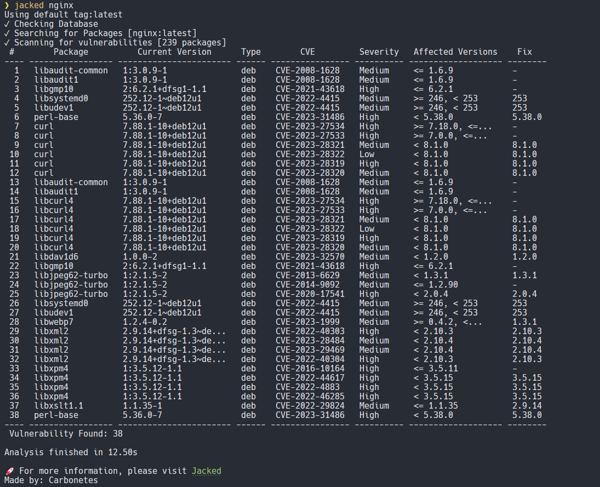
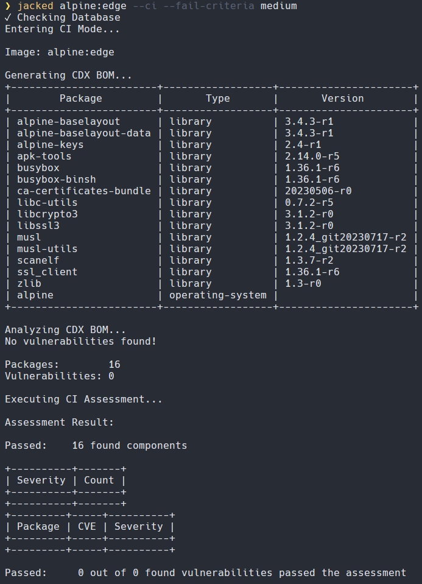

# Jacked
[]()
[](https://goreportcard.com/report/github.com/carbonetes/jacked)
[](https://github.com/carbonetes/jacked/releases/latest)
[](https://github.com/carbonetes/jacked)
[](https://github.com/carbonetes/jacked/blob/main/LICENSE)

Jacked is a powerful open-source tool designed to enhance security measures for Docker images, tarballs, and code repositories. 

<p align="center">

</p>

## Integration with Diggity

**Jacked** works seamlessly with [Diggity](https://github.com/carbonetes/diggity), our powerful tool for generating Software Bill of Materials (SBOM). Together, they provide a comprehensive solution for securing your software development process.


## Key Features:

- **Scan Image Vulnerabilities**: Jacked diligently scans your Docker images, identifying potential security risks and vulnerabilities. This ensures that your deployed containers are robust and free from known threats.
- **Tailored Configuration**: Customize Jacked to align with your specific security preferences. Tailor the tool to suit your organization's unique requirements and security policies.
- **Cross-Platform Compatibility**: Jacked seamlessly integrates with major operating systems and supports various package types. It offers flexibility and compatibility to fit into your existing workflow.
- **Diggity Integration**: Enhance your security posture by leveraging Jacked's compatibility with Diggity. This integration provides SBOM (Software Bill of Materials) Container Image and File System support.
- **Integration-Friendly**: Seamlessly integrate Jacked into your CI/CD pipelines and DevOps workflows to automate vulnerability analysis.
- **User-Friendly Interface**: Jacked offers an intuitive command-line interface, making it accessible to both security experts and developers.
- **Flexible Output Formats**: Jacked provides multiple output formats, making it easy to analyze scan results. Choose from options like tabulated summaries, JSON reports, CycloneDX, SPDX, and more.

With Jacked, you can fortify your software applications against security threats, streamline your vulnerability management process, and deliver software that is secure, compliant, and reliable.

## Vulnerability Data Sources

Jacked leverages multiple trusted data sources for comprehensive vulnerability detection and management:

1. **NVD (National Vulnerability Database):** The NVD provides a rich source of vulnerability data, including CVEs (Common Vulnerabilities and Exposures), which Jacked uses to identify and assess vulnerabilities.

2. **GitHub Advisories:** Jacked monitors GitHub's advisory feed to stay up-to-date with security advisories related to open-source projects hosted on GitHub, enhancing its ability to detect vulnerabilities in widely used libraries and repositories.

3. **Alpine Security Advisories:** Jacked is equipped to access and utilize Alpine Linux's security advisories. This integration ensures that Alpine Linux-based containers are thoroughly scanned for security issues.

4. **Debian Security Advisories:** Jacked taps into Debian's security advisories, enabling it to detect vulnerabilities in packages commonly found in Debian-based systems.

By combining these data sources, Jacked provides a comprehensive and up-to-date view of potential security risks, helping you fortify your applications against known vulnerabilities.

## Installation

## Recommended

### Using Curl (Linux/macOS)
Run the following command to download and install Jacked using Curl:
```bash
bash -c "$(curl -sSL curl -sSfL https://raw.githubusercontent.com/carbonetes/jacked/main/install.sh | sh -s -- -d /usr/local/bin)"
```
**Note**: Use root access with `sudo sh -s -- -d /usr/local/bin` if you encounter a Permission Denied issue, as the `/usr/local/bin` directory requires the necessary permissions to write to the target directory.

### Using Homebrew (Linux/macOS)
First, tap to the jacked repository by running the following command:
```bash
brew tap carbonetes/jacked
```
Then, install Jacked using Homebrew:
```bash
brew install jacked
```
To check if Jacked is installed properly, try running the following command:
```bash
jacked --version
```

### Using Scoop (Windows)
First, add the jacked-bucket by running:
```sh
scoop bucket add diggity https://github.com/carbonetes/jacked-bucket
```
Then, install Jacked using Scoop:
```sh
scoop install jacked
```
Verify that Jacked is installed correctly by running:
```sh
jacked --version
```

# Getting Started
 Jacked offers a user-friendly command-line interface, ensuring that it is accessible to both security experts and developers.

## Scanning Docker Images
To scan a Docker image, use the following command:
```bash 
jacked <image-name:tag>
```
Replace <image_name> with the name of the Docker image you want to scan.

## Scanning Code Repositories
To analyze a code repository, use the following command:
```bash 
jacked --dir <repository-path>
```
## Scanning Tarballs
To scan a tarball, use the following command:
```bash 
jacked --tar <tarball-path>
```

## CycloneDX Support

Jacked offers support for CycloneDX, a lightweight software bill of materials (SBOM) standard. In addition to generating CycloneDX reports in JSON and XML formats, Jacked also supports the use of VEX (Vulnerability Exchange) data within CycloneDX reports. This enhances the accuracy and depth of vulnerability information included in the SBOM.

By utilizing VEX data, Jacked ensures that your CycloneDX reports provide comprehensive and up-to-date vulnerability information, empowering you to make informed decisions about your software's security posture.

## Output formats
Jacked provides flexible options for formatting and presenting scan results, making it easy to tailor the output to your specific needs. 
```bash
jacked <target> -o <output-format>
```
 You can choose from the following output formats:
- `table`: The default output format, providing a concise columnar summary of the scan results. This format is ideal for a quick overview of vulnerabilities.
- `json`: Get detailed scan results in JSON format, enabling easy integration with other tools and systems for further analysis and automation.
- `cdx-json`: Receive scan reports in JSON format that conform to the [CycloneDX 1.5 JSON Schema](https://github.com/CycloneDX/specification/blob/master/schema/bom-1.5.schema.json). This format is useful for compatibility with CycloneDX-aware tools and platforms.
- `cdx-xml`: Similar to CycloneDX JSON, this format provides scan reports in XML format, following the [CycloneDX 1.5 XML Schema](https://github.com/CycloneDX/specification/blob/master/schema/bom-1.5.xsd).

Choose the output format that best suits your integration requirements and reporting preferences. Jacked's versatile output options ensure that you can effectively communicate and act on your scan results in a way that aligns with your workflow.

## Vulnerability Severity Threshold
Jacked provides a powerful feature that allows you to set a severity threshold for vulnerabilities, helping you control the actions triggered based on the severity level of identified vulnerabilities. With this feature, you can tailor your security policies to align with your organization's risk tolerance and operational requirements.

### How it Works

In CI mode `--ci`, Jacked can be configured to evaluate the severity of vulnerabilities detected in your images or code repositories. By adding `--fail-criteria` option on scan arguments, you can specify the severity threshold that your organization deems acceptable, such as "low," "medium," or "high."

By defining a severity threshold, you can specify which vulnerabilities should trigger specific actions or policies. For example, you might want to:

- **Fail a CI/CD Pipeline**: Jacked can be integrated into your CI/CD pipeline to halt the pipeline execution if vulnerabilities of a certain severity level (e.g., "low" or higher) are detected. This ensures that only secure code gets deployed.
- **Generate Alerts**: Configure alerts or notifications to be sent to relevant team members when vulnerabilities exceed the specified severity threshold. Stay informed and act swiftly when critical issues arise.

- **Customize Actions**: Define custom actions or policies based on severity levels. For instance, you can automatically open a ticket in your issue tracking system for "high" severity vulnerabilities.

Here's an example of how to use this feature. To trigger a CI pipeline failure if any vulnerabilities are found in the image with a severity of "low" or higher, use the following command:
```bash
jacked <image> --ci --fail-criteria medium
```
<details>
<summary>Sample Evaluation</summary>



</details>

## Useful Commands and Flags
```
jacked [command] [flag]
```

|     SubCommand   |                  Description                 |
| :--------------- | :------------------------------------------- |
| `config`         | Display the current configurations           |
| `db`             | Display the database information             |
| `version`        |  Display Build Version Information of Jacked |

### Available Commands and their flags with description:
```
jacked [flag]
```
|                Root Flags                |                                                      Description                                                           |
| :--------------------------------------- | :------------------------------------------------------------------------------------------------------------------------- |
| `--sbom string`                          | Input sbom file from diggity to scan (Only read from json file)                                                            |
| `-d`, `--dir string`                     | Read directly from a path on disk (any directory) (e.g. 'jacked path/to/dir)'                                              |
| `-t`, `--tar string`                     | Read a tarball from a path on disk for archives created from docker save (e.g. 'jacked path/to/image.tar)'                 |
| `--disable-file-listing`                 | Disables file listing from package metadata (default false)                                                                |
| `--enabled-parsers stringArray`          | Specify enabled parsers ([apk debian java npm composer python gem rpm dart nuget go]) (default all)                        |
| `-l`, `--licenses`                       | Enable scanning for package licenses                                                                                       |
| `-o`, `--output string`                  | Show scan results in "table", "json", "cyclonedx-json", "cyclonedx-xml", "spdx-json", "spdx-xml", "spdx-tag-value" format (default "table") |
| `--registry-uri string`                  | Registry uri endpoint (default "index.docker.io/")                                                                         |
| `--registry-token string`                | Access token for private registry access                                                                                   |
| `--registry-username string`             | Username credential for private registry access                                                                            |
| `--registry-password string`             | Password credential for private registry access                                                                            |
| `--secret-exclude-filenames stringArray` | Exclude secret searching for each specified filenames                                                                      |
| `--secret-max-file-size int`             | Maximum file size that the secret will search -- each file (default 10485760)                                              |
| `-v`, `--version`                        | Print application version                                                                                                  |
| `--ignore-package-names`                 | Specify package names to be whitelisted on the result                                                                      |
| `--ignore-vuln-cves`                     | Specify CVEs to be whitelisted on the result                                                                               |

```
jacked config [flag]
```
|    Config Flags  |                Descriptions                  |
| :--------------- | :-------------------------------------------- |
| `-d`,`--display` | Display the content of the configuration file |
| `-h`,`--help`    | Help for configuration                        |
| `-p`,`--path`    | Display the path of the configuration file    |
| `-r`,`--reset`   | Restore default configuration file            |

```
jacked db [flag]
```
|   Database Flags   |               Descriptions              |
| :---------------- | :--------------------------------------- |
| `-i`, `--info`    | Print database metadata information      |
| `-v`, `--version` | Print database current version           |

```
jacked version [flag] [string]
```
|            Version Flags            |                                  Descriptions                                      |
| :--------------------------------- | :---------------------------------------------------------------------------------- |
| `-f` [string], `--format` [string] | Print application version format (json, text) (default "text")                      |

## Configuration 🚧
Improve using the tool based on your preferences.
<br>
Configuration search paths:
- `<HOME>/.jacked.yaml`

Configuration options (example values are the default):

```yaml
# supported output types: (table, json, cyclonedx-xml, cyclonedx-json, spdx-xml, spdx-json, spdx-tag-value) (default "table") 
output: table
# disables all logging except vulnerability result
quiet: false
# policies configurations
ignore:
  # ignore policy for vulnerabilities to exclude
  vulnerability:
    cve: []
    severity: []
  # ignore policy for packages to exclude
  package:
    name: []
    type: []
    version: []
# specify enabled parsers ([apk debian java npm composer python gem rpm dart nuget go]) (default all)
enabled-parsers: []
# disables file listing from package metadata
disable-file-listing: false
# secret configurations
secret-config:
  # enables/disables cataloging of secrets
  disabled: false
  #secret content regex are searched within files that match the provided regular expression
  secret-regex: API_KEY|SECRET_KEY|DOCKER_AUTH
  #excludes/includes secret searching for each specified filename
  excludes-filenames: []
  # set maximum file size to avoid problems with large files
  max-file-size: 10485760
# enable scanning of licenses
license-finder: false
# registry configurations
registry:
# registry uri endpoint
  uri: ""
  # username credential for private registry access
  username: ""
  # password credential for private registry access
  password: ""
  # access token for private registry access
  token: ""
```

## Contributing
We welcome contributions to Jacked from the community. We believe that collaboration and contributions from the community are essential to making Jacked even better. Whether it's reporting issues, submitting pull requests, or providing feedback, your input helps improve this project for everyone. Please check our [Contribution Guidelines](https://github.com/carbonetes/jacked/blob/main/CONTRIBUTING.md) for more details on how to get involved.

By contributing to Jacked, you agree to abide by our [Code of Conduct](https://github.com/carbonetes/jacked/blob/main/CODE_OF_CONDUCT.md). We are committed to maintaining an open, inclusive, and respectful community.

If you encounter bugs, have ideas for improvements, or want to request new features, please don't hesitate to open an issue on our [GitHub repository](https://github.com/carbonetes/jacked/issues).

## Contact

If you have any questions, suggestions, or need assistance, you can reach us at [eng@carbonetes.com](mailto:eng@carbonetes.com). Your feedback and engagement are valuable to us.

## License

Jacked is released under the [Apache License 2.0](https://choosealicense.com/licenses/apache-2.0/). You are free to use, modify, and distribute this software in compliance with the terms and conditions of the Apache License 2.0. Please review the full license text for more details.

<footer>
<h4>
  <p align="center">
    Jacked is developed and maintained by <a href="https://carbonetes.com/">Carbonetes</a>. 
  </p>
</h4>
</footer>